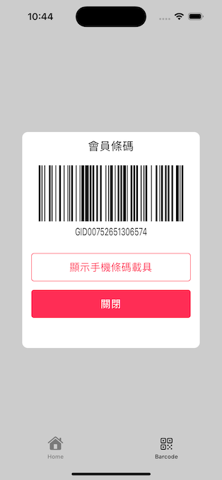
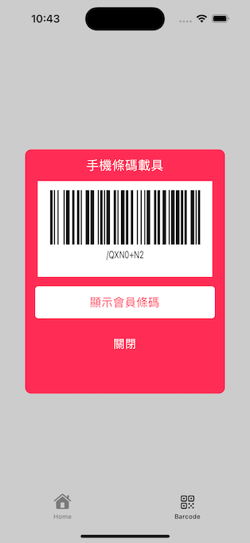

# About

#### The *PopUpBarcodeViewController* is designed to display a barcode or member code.

#### And satisfies following requirements: 
- When the displayed, set the screen brightness to maximum.
- Upon leaving or tap other view controller, adjust the brightness back to the user's original setting.
- When switching to another application, set the screen brightness to the original setting.
- Upon returning to the application, set the screen brightness to maximum.

## Run
This demo is best run on an iPhone to better experience the changes in screen brightness.